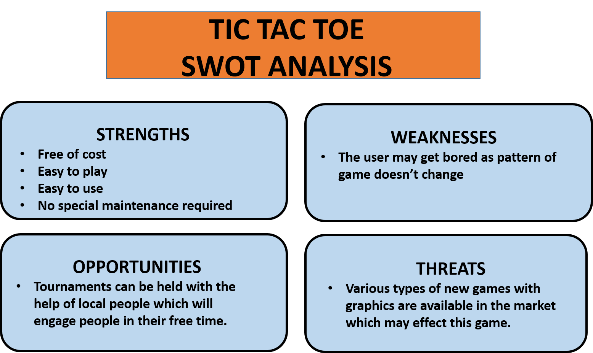

# **INTRODUCTION**
>In this tic tac toe on c, both players must enter a particular number one to nine based on the grid position in order to make a mark X or O. In the tic tac toe game,winner will be the first player who successfully position three of their marks in a horizontal, vertical, or diagonal row.
>This game is build using C language
 

# **FEATURES**
1. Single player with computer as second player
2. Display "Winner" (User or Computer)
3. Display "Game Draw" if no chances left
 

# **RESEARCH**
Fast-forward about 30 years when the first printed reference to “tick-tack-toe” was recorded. It was defined as "a children's game played on a slate” and is played while “trying with the eyes shut to bring the pencil down on one of the numbers of a set, the number hit being scored.”

The modern spelling of Tic Tac Toe didn’t come into play until the early 20th century in the United States, where it was renamed from the British Noughts and Crosses. 

Tic Tac Toe was brought to the digital world in 1952 as a game called “OXO.”
 
 

# **RULES FOR TIC-TAC-TOE**

- The game is played on a grid that's 3 squares by 3 squares.

- You are X, your friend (or the computer in this case) is O. Players take turns putting their marks in empty squares.

- The first player to get 3 of her marks in a row (Vertical, Horizontal or Diagonally) is the winner.

-	When all 9 squares are full, the game is over. If no player has 3 marks in a row, the game ends in a tie.
 

# **4W's and 1'H**
## Who:

- People of any age group can play this game.

## What:

- It is played on computer rather than pen and paper, so that environment friendly too.

## When:

- A person needs to have access to a computer to play this game at any point of time.

## Where:

- To play, this game needs to be installed on computer.

## How:

- The game is played between two players where one player make the move by 'X'  and another by '0' and after meeting certain conditions a player is declared as winner or the game is drawn.
 

# **Detailed Requirements**

## **High Level Requirements**

| ID | Description | 
| ----- | ----- | 
| HR01 | User should be able to choose 'X' or 'O' to play |
| HR02 | User should be able to Exit the game |
| HR03 | User should win or lose|
| HR04 | User should end up in a Drawn situation|

##  Low level Requirements:

| ID | Description | HLR ID |
| ------ | --------- | ------ |
| LR01 | If the user presses '1', he'll be play with 'X'. | HR01 |
| LR02 | If the user is playing with 'X', he'll get the first turn. | HR01 |
| LR03 | If the user presses '2', he'll be play with 'O'. | HR01 |
| LR04 | If the user is playing with 'O', he'll get the second turn. | HR01 |
| LR05 | If the user presses '3', it'll exit the game. | HR02 |
| LR06 | If the computer gets 3 Xs or 3 Os in vertical,horizontal or diagonal row, User will lose. | HR03 |
| LR07 | If the user gets 3 Xs or 3 Os(as per his choice), in vertical,horizontal or diagonal row, User will win. | HR03 |
| LR08 | If the total number of moves, i.e., 9 moves have been completed and neithe the user nor the computer has won, it'll end up in a draw. | HR04 |

# **SWOT ANALYSIS**

   
